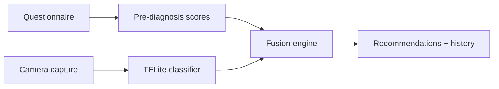

# SAT-PlantScan — Architecture

## Overview

SAT-PlantScan follows **Clean Architecture** with clear separation of concerns:

```
app/lib/
├── core/           # Theme, routing, DI, shared widgets
├── domain/         # Entities, repository contracts, business rules
├── data/           # JSON/Hive/TFLite implementations
└── features/       # UI pages (presentation)
```

## Extensibility model

Adding a new crop (e.g. maize) requires **no code rewrite**:

1. Add images under `Cultures/Maize/...`
2. Create `knowledge_base/crops/maize/` (manifest, diseases.json, questionnaire.json)
3. Copy assets to `app/assets/knowledge/crops/maize/`
4. Register crop in `knowledge_base/crops/registry.json`
5. Train/export a crop-specific TFLite model (optional shared backbone)

## Diagnosis pipeline



Fusion formula (independent probabilities):

`P_final = 1 - (1 - P_pre) × (1 - P_vision)`

Example: pre=72%, vision=95% → merged≈98%.

## Vision model choice

| Model | Role in SAT-PlantScan |
|-------|------------------------|
| **EfficientNet-B0 → TFLite** | **Selected** — best accuracy/latency/memory trade-off for multi-class leaf classification with transfer learning |
| MobileNetV3 | Faster, slightly lower accuracy on fine-grained symptoms |
| YOLOv11 | Reserved for future localization (region of interest), not required for v1 whole-image classification |
| ViT | Higher compute cost on low-end Android devices |

## Offline-first

- Knowledge base bundled in assets
- History stored locally (Hive)
- TFLite inference on-device
- No user data sent to cloud

## Scientific sources

Recommendations are sourced from `/Ouvrages` and FAO cassava disease documentation. Do not add agronomic advice without bibliographic support.

## Git branching (recommended)

| Branch | Purpose |
|--------|---------|
| `main` | Stable releases |
| `develop` | Integration |
| `feature/*` | New crops, ML experiments, UI |

## Tests

- `app/test/diagnosis_engine_test.dart` — fusion + questionnaire scoring
- Run: `cd app && flutter test`
